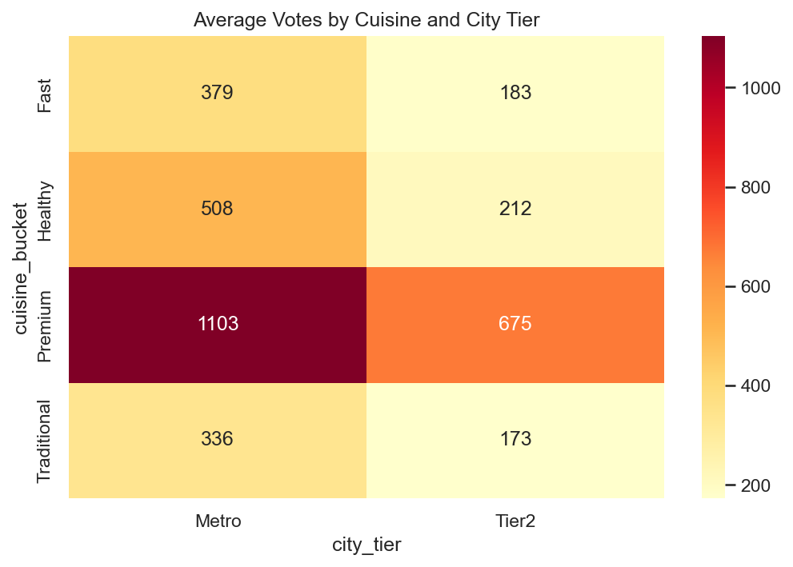

# zomato-convenience-premium
Analysing whether convenience or quality drives restaurant popularity on Zomato Bangalore
# The Convenience Premium 🍽️
### Do consumers reward convenience over quality when choosing restaurants?

**Dataset:** Zomato Bangalore | 41,646 restaurants | [Kaggle Source](https://www.kaggle.com/datasets/himanshupoddar/zomato-bangalore-restaurants)

---

## Hypothesis
Consumers claim quality matters. But does actual behaviour — measured by votes —
tell a different story? This project tests whether convenience features like online
ordering and fast cuisines drive popularity more than ratings do.

---

## Key Findings

**1. Rating is the strongest predictor of votes — by far**
Restaurants rated 4.5+ receive an average of 3,446 votes compared to just 42
for restaurants rated 3.0–3.4. A 20x difference driven entirely by quality score.

**2. Premium cuisine dominates, not fast food**
Premium restaurants average 842 votes vs 230 for Fast cuisine — despite Fast
food being considered the "convenient" category. Consumers vote with their
experience, not just their ease of access.

**3. Online ordering effect is location-dependent**
In Metro areas, offline restaurants outperform online ones (675 vs 498 avg votes)
— these are premium dine-in establishments. In Tier 2 areas, online ordering
provides a small edge (281 vs 236). Convenience matters more where dining
infrastructure is weaker.

---

## Best Chart

---

## Tools Used
| Tool | Purpose |
|---|---|
| Python (pandas) | Data cleaning, feature engineering |
| MySQL Workbench | SQL analysis, hypothesis testing |
| Matplotlib / Seaborn | Visualisations |
| Excel | Dashboard for non-technical audience |

---

## Dataset
The raw dataset exceeds GitHub's file size limit.
Download it here: [Zomato Bangalore Restaurants](https://www.kaggle.com/datasets/himanshupoddar/zomato-bangalore-restaurants)
After downloading, run `zomato.ipynb` from the top to regenerate the cleaned data.

---

## Limitations
- Votes are a proxy for popularity, not a direct measure of satisfaction
- City tier classification uses location name matching — not official tier data
- Cuisine bucketing is keyword-based; multi-cuisine restaurants are assigned
  to their dominant category
- Dataset reflects a single point in time — no temporal trends captured

---

## Conclusion
The data partially challenges the hypothesis. Online ordering alone does not
drive votes. Quality — measured by rating — is the dominant predictor. However,
the city tier finding adds nuance: convenience features matter more in markets
with weaker dining infrastructure, suggesting the convenience premium is
real but contextual.
